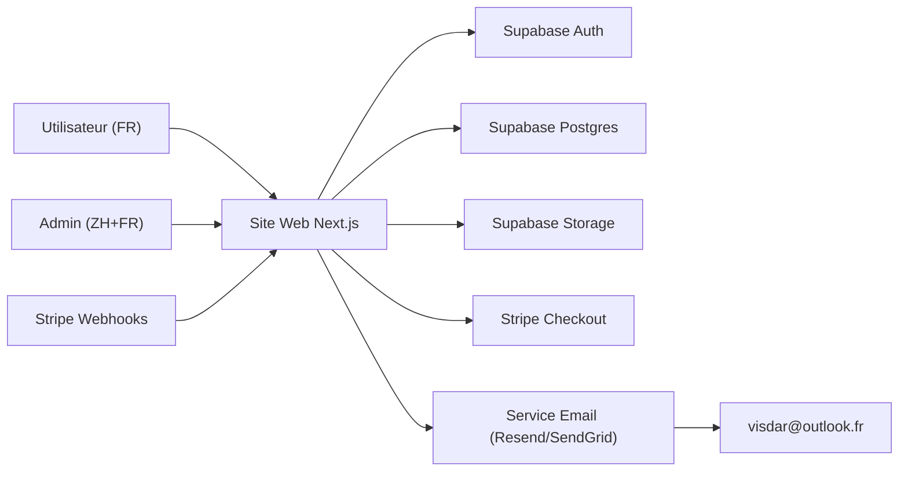

# Visd AR 电子书独立站 技术架构（Supabase + Stripe）

## 1. 技术目标
- 用尽量简单的结构实现“法语用户站 + 中法双语后台”
- 支持数字商品（电子书）交付与退款/拒付防御
- 便于后续新增图书、类目、推荐、小游戏模块

## 2. 技术选型（建议）
- 前端/全栈框架：Next.js（App Router）+ TypeScript
- UI：Tailwind CSS（配合自定义 CSS 变量与动效）
- 数据库：Supabase Postgres
- 鉴权：Supabase Auth（Google、GitHub、Email）
- 文件：Supabase Storage（封面、电子书文件）
- 支付：Stripe Checkout + Webhooks
- 邮件通知（给管理员）：通过邮件服务（建议 Resend / SendGrid），收件人固定 visdar@outlook.fr

说明：若你希望 100% 只用 Supabase，不引入额外邮件服务，可使用 Supabase Edge Functions 结合第三方邮件 API；不建议直接使用 Outlook SMTP 作为发件服务。

## 3. 系统架构图

## 4. 关键业务流程

### 4.1 注册/登录
- 用户端：Google / GitHub OAuth 登录；Email 登录（magic link 或密码）
- 后台：同一套登录，但必须具备 admin 角色才能访问 /admin

### 4.2 下单与支付
1. 用户在站点选择图书点击购买
2. 服务端创建 Stripe Checkout Session（绑定 productId、userId、价格、币种 EUR）
3. Stripe 回跳到成功页 success_url
4. Stripe Webhook（checkout.session.completed）写入订单与购买记录，标记 paid

### 4.3 交付与下载防御
策略：不提供公开直链，不把文件 URL 暴露为长期有效地址。
- 用户进入“我的购买记录”，点下载
- 服务端校验：
  - 当前用户是否拥有该订单/商品
  - 订单是否为 paid 且未 refunded/disputed
  - 下载次数与有效期是否未超限
- 通过 Supabase Storage 生成短时效签名 URL（Signed URL）返回给前端下载
- 写入下载日志（IP、UA、时间、订单、商品）

### 4.4 退款/拒付（防御核心）
通过 Stripe Webhook 监听事件（至少）：
- charge.refunded / refund.updated（或 payment_intent 相关退款事件）
- charge.dispute.created / charge.dispute.updated
处理规则：
- 将订单状态置为 refunded / disputed
- 立即锁定订单的 download_enabled=false
- 若争议升级，额外标记用户风险等级 risk_level

补强（可选）：
- PDF 水印：支付后生成带水印文件并存储（需要服务器端处理）
- 反滥用：对下载接口限流（IP + userId + orderId），并开启基本风控规则

## 5. 数据库设计（建议表）

### 5.1 users / profiles
- profiles
  - id (uuid, pk, = auth.users.id)
  - email
  - display_name
  - role (enum: user/admin)
  - risk_level (int, default 0)
  - created_at

### 5.2 catalog
- categories
  - id (uuid, pk)
  - name_fr
  - name_zh (后台展示用)
  - sort_order
  - is_active

- products
  - id (uuid, pk)
  - title_fr
  - title_zh (后台展示用)
  - description_fr
  - description_zh (后台展示用)
  - category_id (fk)
  - cover_path (storage path)
  - amazon_paperback_url
  - is_active
  - inventory_mode (enum: unlimited/limited)
  - stock_quantity (int, nullable)
  - price_eur_cents (int)
  - stripe_price_id (text)
  - created_at

- product_files
  - id
  - product_id (fk)
  - file_path
  - file_type (enum: pdf/epub/mobi/other)
  - file_size

### 5.3 promotions
- promotion_seasons
  - id
  - name_fr
  - name_zh
  - starts_at
  - ends_at
  - banner_text_fr
  - banner_text_zh
  - is_active

- coupons
  - id
  - code
  - discount_type (enum: percent/fixed)
  - discount_value
  - starts_at
  - ends_at
  - max_redemptions
  - redemption_count
  - scope (enum: all/category/product)
  - scope_ref_id (nullable)
  - is_active

说明：也可以直接使用 Stripe Coupons/Promotion Codes，并将“优惠季文案与倒计时”留在数据库内。这样支付侧更标准、对账更一致。

### 5.4 orders / delivery
- orders
  - id (uuid, pk)
  - user_id (fk)
  - stripe_checkout_session_id
  - stripe_payment_intent_id (nullable)
  - status (enum: pending/paid/refunded/disputed)
  - currency
  - amount_total_cents
  - created_at

- order_items
  - id
  - order_id (fk)
  - product_id (fk)
  - unit_price_cents

- downloads
  - id
  - user_id
  - order_id
  - product_id
  - ip
  - user_agent
  - created_at

### 5.5 messages
- messages
  - id
  - user_id (nullable)
  - email (nullable)
  - subject
  - content
  - status (enum: new/handled)
  - created_at

### 5.6 recommendations
- recommendations
  - id
  - product_id
  - recommended_product_id
  - reason_fr
  - reason_zh
  - sort_order

## 6. Supabase 安全策略（RLS）
- products、categories：对 public 只读（is_active=true），对 admin 可写
- orders、downloads：仅 owner（auth.uid()=user_id）可读；admin 可读写
- storage：
  - 封面：public bucket 或者 public read（便于展示）
  - 电子书文件：private bucket，必须通过 Signed URL 下载

## 7. Stripe 集成策略
- 价格与商品：
  - products/price 在 Stripe 创建，保存 price_id 到数据库
  - Donation 使用单独的“donation”产品，支持自定义金额（donation 模式可通过 Payment Links 或 Checkout 自定义金额实现）
- Webhook：服务端校验签名，写库并更新订单状态

## 8. 国际化与文案
- 用户端：默认强制法语
- 管理后台：同屏双语字段展示（中文 + 法语）

## 9. 部署建议
- 托管：Vercel（Next.js 原生支持）
- 环境变量：Supabase URL/KEY、Stripe keys、Webhook secret、邮件服务 key
- 域名：自定义域名 + HTTPS

## 10. 需要你提供的关键输入（影响实现）
- 电子书文件（PDF/EPUB/MOBI）与封面高清图
- 4 本书的 Amazon 纸质版链接（若要从 author store 拆分到每本）
- 法语文案：品牌介绍、支持页文案、退款政策要点
- 你的运营身份信息（用于法律页面：Mentions légales / Politique de confidentialité）

